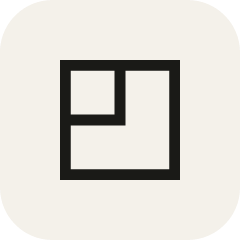
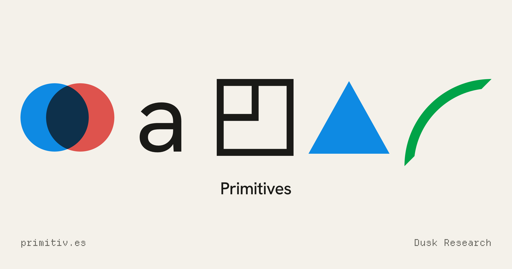
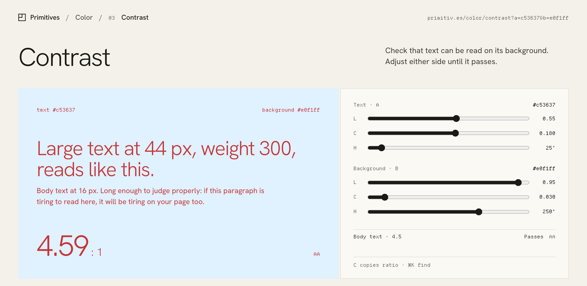

<div align="center">



# Primitives

**Instruments for the fundamentals of design.**

Precise tools for everyday design decisions. One question per screen, and every answer is a link.

[](https://primitiv.es)
[](https://primitiv.es/requests)
[](LICENSE)



</div>

## What it is

Primitives is a set of small instruments for the elements all digital work is made of: color, type, grid, shape, motion and more. Each one answers a single question on a single screen. The tool comes first, a plain explanation sits underneath and cites the standard it follows, and related instruments come after. It is free and needs no account.

It is for the work itself: setting up scales, palettes, grids and motion before they become tokens; checking something mid-task, like whether a gray is readable on white or what 18 px is in rem; learning why an answer is right; or finding one answer fast for a deck, a landing page or a favicon.

## Every result is a link

What you set lives in the address and nowhere else. Send it, bookmark it or paste it into a ticket, and whoever opens it sees exactly what you saw.

<div align="center">
<a href="https://primitiv.es/color/contrast?a=c53637&b=e0f1ff"></a>
<br />
<sub><code>primitiv.es/color/contrast?a=c53637&b=e0f1ff</code> opens exactly this.</sub>
</div>

## The catalogue

Thirteen primitives and fifty instruments, shipped one at a time. **Contrast** is live; the rest are planned.

| | Primitive | Instruments |
|---|---|---|
| 01 | **Color** | Pick · Scale · **[Contrast](https://primitiv.es/color/contrast)** · Harmony · Convert · Blend |
| 02 | **Type** | Scale · Specimen · Measure · Units · Fallback |
| 03 | **Grid** | Columns · Breakpoints · Baseline · Layout |
| 04 | **Shape** | Form · Corner · Polygon · Blob · Favicon |
| 05 | **Motion** | Ease · Spring · Duration · Stagger · Export |
| 06 | **Space** | Scale · Inset · Tokens |
| 07 | **Light** | Shadow · Elevation · Blur |
| 08 | **Noise** | Grain · Gradient · Texture |
| 09 | **Ratio** | Aspect · Proportion · Crop |
| 10 | **Pattern** | Tile · Stripes · Export |
| 11 | **Icon** | Grid · Stroke · Optical |
| 12 | **Random** | UUID · Range · Dice · Shuffle · Seed |
| 13 | **State** | Machine · Export |

Something missing? Suggest it on the [requests board](https://primitiv.es/requests). Visitors vote, and the votes set the order.

## The math, for people and agents

Every instrument's logic lives in [`packages/primitives`](packages/primitives): pure functions, one plain object in and one out, no DOM and no I/O. The site imports them today. The same operations will be served as JSON endpoints and published as a package, so an agent can ask the questions a person does. Neither exists yet.

```ts
import { operations } from '@duskresearch/primitives/color';

operations.contrast({ text: '#9a9a9a', background: '#ffffff' });
// {
//   ratio: 2.81,
//   grade: 'Fails',
//   passes: { bodyAA: false, largeAA: false, bodyAAA: false, largeAAA: false },
//   fix: { text: { hex: '#767676', oklch: { l: 0.5662, c: 0, h: 0 } }, ratio: 4.53, direction: 'darken' },
//   ...
// }
```

## How it's built

- **[Astro](https://astro.build)** with **[Svelte](https://svelte.dev)** islands. Instrument pages render on demand, so a shared link arrives with its state already in the HTML; everything else is prerendered.
- **[Cloudflare Workers](https://workers.cloudflare.com)** with static assets, and **[D1](https://developers.cloudflare.com/d1/)** for requests, votes and the email list. No cookies and no accounts: a vote is a salted hash.
- **Color math** by [culori](https://culorijs.org), in OKLCH so steps look even to the eye, with WCAG 2.x contrast measured on the colors as displayed.
- **One mark, one source.** The favicons, app icons and social images are drawn from `src/lib/logo.ts` at build time with [Satori](https://github.com/vercel/satori) and [resvg](https://github.com/yisibl/resvg-js).
- **Type** in Hanken Grotesk and Departure Mono, self-hosted.

## Develop

```sh
npm install
npm run dev                   # http://localhost:4321, runs in the Workers runtime (workerd)
npm test                      # unit tests (color math, URL state)
npm run check                 # type check
npm run build                 # static pages + the Worker for on-demand instrument pages
npm run preview               # serve the production build locally
npm run assets                # favicons, app icons, OG images (also run by dev and build)
npm run db:migrate            # apply migrations/ to the local D1 database
npm run requests -- held      # review the requests board (--remote for production)
```

Local development uses a local D1 database and `.dev.vars` for `VOTE_SALT`; production needs `npx wrangler secret put VOTE_SALT`.

## Add an instrument

1. Put its logic in `packages/primitives/src/<primitive>/` as an operation keyed by the instrument's slug, with tests. The tool imports it from `@duskresearch/primitives/<primitive>`.
2. Its entry already exists in `src/data/catalogue.json` (name, number, does, pain, keywords, primary value). Keep copy there.
3. Create `src/instruments/<primitive>/<slug>/`:
   - `meta.ts`: `purpose` (one sentence shown above the tool), `primaryLabel` (what `C` copies), `related` slugs.
   - `Tool.svelte`: renders `.surface` and `.panel` as top-level elements. Reads state from its `initial` prop, reports changes with `setQuery(serialize(state))`, marks copyable values with `Copy` (and the primary one with `primary`).
   - `explain.md`: front matter `title` and `description`, then exactly four `##` sections: What it measures, How it is computed, When to use it, Related. 120 to 220 words each.
4. Add `src/pages/<primitive>/<slug>.astro`, copying `src/pages/color/contrast.astro`.

The instrument goes live everywhere (index, search, related lists, sitemap, llms.txt) once `meta.ts` exists. The definition of done is in [`design/README.md`](design/README.md), and the rules coding agents follow are in [`CLAUDE.md`](CLAUDE.md).

## Where things are

```
design/                       the brief (README.md), the mark (MARK.md), the approved reference
packages/primitives/          the instruments' logic, one module per primitive: JSON in, JSON out
src/data/tokens.json          every design value; scripts/build-tokens.mjs writes src/styles/tokens.css
src/data/catalogue.json       every primitive and instrument, shipped and planned, with copy
src/instruments/<p>/<i>/      one folder per instrument: meta.ts, Tool.svelte, explain.md
src/pages/<p>/<i>.astro       the instrument's route: parses URL state, renders the harness
src/layouts/Instrument.astro  the harness: breadcrumb, stateful address, tool, explanation, related
src/lib/logo.ts               the Primitives mark, the one source for header, icons and OG images
src/lib/moderation/           the checks every suggestion passes before it reaches the board
migrations/                   the D1 schema: suggestions, votes, the email list, rate limits
```

## License

MIT. See [LICENSE](LICENSE). Hanken Grotesk and Departure Mono are under the SIL Open Font License 1.1.

---

<div align="center"><sub>One question, one instrument. Built by <a href="https://duskresearch.com">Dusk Research</a>.</sub></div>
